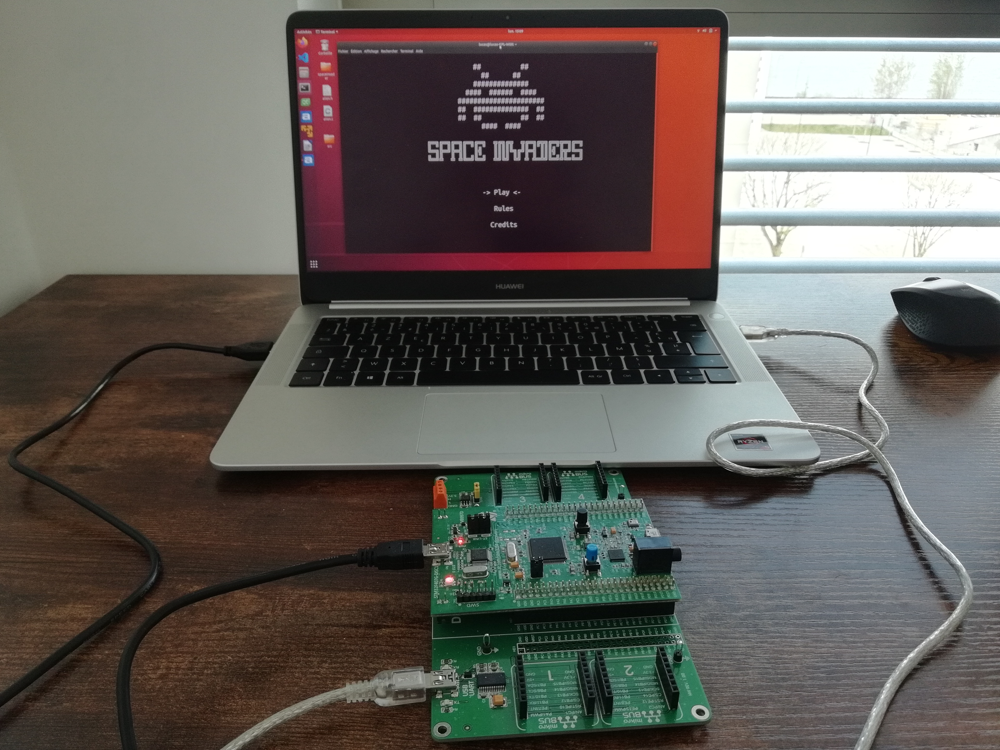
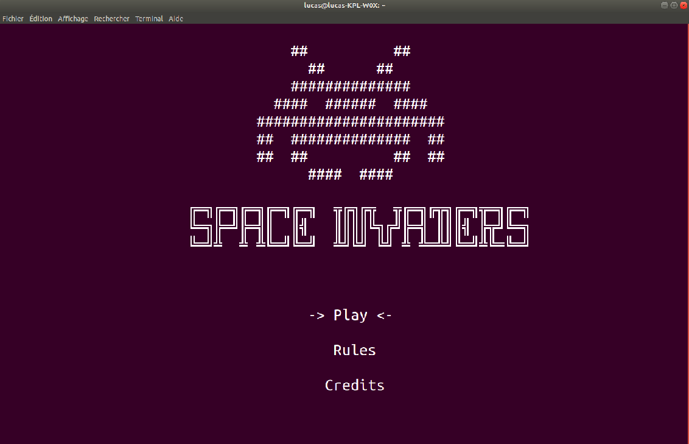
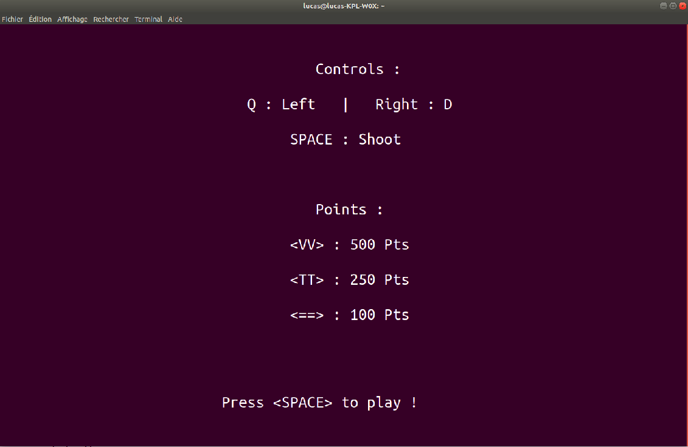
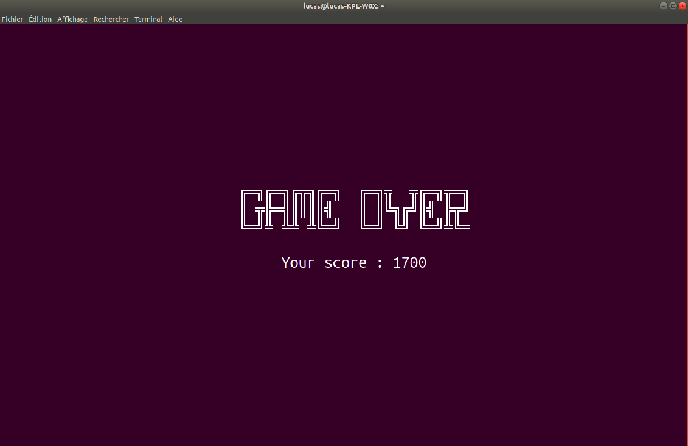

# SPACE INVADERS

## Présentation du projet

Dans le cadre de ma formation (3ème année de bachelor) nous avons eu à réaliser le jeu **Space Invaders** en **Language C** sur une carte **STM32F4_Discovery**

## Présentation du jeu
Le principe est de détruire des vagues d'aliens au moyen d'un canon laser en se déplaçant horizontalement sur l'écran

le joueur dispose de 3 vies, dès qu'il est touché par une bombe ennemie celui-ci perd une vie

pour gagner il suffit de détruire tous les vaisseaux ennemis.

## Présentation de la carte

La carte **STM32F4_Discovery** envoie une suite de caractères via sa liaison série, le jeu étant affiché sur un terminal série d'un ordinateur par exemple



Comme le montre le cablage nous avons un cable USB permettant d'alimenter la carte et de téléverser le programme et un autre cable USB permettant de communiquer en série avec un terminal

# Mode d'emploi pour lancer le jeu

* Effectuer le branchement (image au dessus)
* Téléverser le programme sur votre Carte **STM32F4_Discovery**
* Lancer un terminal de liaison série
  
  Dans mon cas j'utilise **screen** sur linux :
  ```
  sudo apt install screen
  screen /dev/tty<Port COM> 115200
  ```
* Appuyez sur le bouton reset (noir)

Une fois dans le menu de vous pouvez changer votre sélection avec les touches **Z** et **S**, les controles étant aussi disponible dans l'onglet **"Rules"**

# Le code

Pour développer le jeu j'ai utilisé le logiciel Atolic True Studio, il contient :
- un éditeur de texte
- un compilateur
- un debuggeur

qui m'ont été utile durant toute la période du projet.

## La communication série

Il faut tout d'abord établir une liaison UART entre la carte et notre ordinateur
comme il s'agit d'une communication asynchrone il faut préciser un débit de transmission, dans mon cas j'ai choisi un baud-rate de 115 200 baud

J'ai donc utilisé les extensions **serial.h** et **serial.c** qui comporte 3 fonctions utiles dans le cadre de mon projet, la première est :
```c
void serial_init(const uint32_t baudrate);
```
Elle permet de définir la vitesse de transmission de ma carte

la seconde est :
```c
signed char serial_get_last_char(void);
```
Elle permet de récupérer la dernière touche appuyée, dans mon cas j'utilise cette fonction de la manière suivante : 
```c
input = serial_get_last_char();
```
Cela permet de lire la valeur du **serial_get_last_char()** et de stocker cette valeur dans la variable **input**, par exemple si la dernière touche appuyée est la barre espace, j'aurais son numéro dans la table ASCII qui est 32.

Les deux prochaines sont :
```c
void serial_putchar(const volatile char c);
void serial_puts(const volatile char *s);
```

Celles-ci permettent d'envoyer pour **serial_putchar** d'envoyer un seul caractère et pour **serial_puts** d'envoyer plusieurs caractères sur la liaison série

Pour recevoir ces transmissions sur notre ordinateur nous utilisons un terminal connecté sur la liaison série du port **ttyUSB0** dans notre cas
```
screen /dev/ttyUSB0 115200
```
J'utilise l'application screen pour ouvrir sur un terminal connecté à mon port série

## VT100

Pour notre jeu, nous utilisons le format d'affichage du VT100 qui est du 80x24

les VT100 dispose de séquence d'échappement permettant par exemple de déplacer le curseur de notre terminal aux coordonnées souhaitées ou encore d'effacer l'intégralité de l'écran du terminal

Nous avons donc utilisé les extensions **vt100.h** et **vt100.c**

ces extensions comportent deux fonctions :
```c
void vt100_move(uint8_t x, uint8_t y)
{
    serial_putchar(VT100_ESC);
    serial_putchar('[');
    serial_putchar('0' + (y / 100));
    serial_putchar('0' + ((y / 10) % 10));
    serial_putchar('0' + (y % 10));
    serial_putchar(';');
    serial_putchar('0' + (x / 100));
    serial_putchar('0' + ((x / 10) % 10));
    serial_putchar('0' + (x % 10));
    serial_putchar('H');
}
```
**vt100_move** comprend deux paramètres d'entrés **x** et **y** qui permettent de déplacer le curseur du terminal sur les coordonnées **x** et **y**

```c
void vt100_clear_screen(void)
{
    serial_putchar(VT100_ESC);
    serial_putchar('[');
    serial_putchar('2');
    serial_putchar('J');
    serial_putchar(VT100_ESC);
    serial_putchar('[');
    serial_putchar('?');
    serial_putchar('2');
    serial_putchar('5');
    serial_putchar('l');
}
```
**vt100_clear_screen** qui permet d'effacer l'intégralité de l'écran

Ces deux fonctions sont très utilisées dans mon programme.

## Game status

Les extensions **game_status.h** et **game_status.h** sont deux extensions crée par moi

le game_status contient les fonctions suivantes :
```c
void game_waiting_screen(void);
void game_loose(void);
void game_win(void);
void game_credit(void);
int refresh_screen(void);
```
Le **game_waiting_screen()** est l'écran d'accueil du jeu, on peut y retrouver un logo en ASCII art et un titre "Space Invarders", en dessous nous avons un menu contenant 3 choix possibles :
- Play (pour lancer le jeu)
- Rules (un onglet contenant les commandes ainsi que le barème des points)
- Crédits (Pour afficher les crédits du jeu)

```c
while (input != 32) /*32 ASCII de l'espace*/
{
    if (input == 'z') {
        if (selection > 0) {
            selection--;
            refresh_screen();
            }
    }
    if (input == 's') {
        if (selection < 2) {
            selection++;
            refresh_screen();
        }
    }

    input = serial_get_last_char();
}
```
Nous avons une variable **selection** qui peut contenir 3 valeurs de 0 à 2 nous pouvons modifier cette variable avec les deux touches **Z** pour incrémenter et **S** pour décrémenter, cette boucle est effectuer tant que l'utilisateur n'appuie pas sur la barre espace.

Une fois la barre espace appuyé suivant la valeur de sélection cela va soit lancer le jeu, menu des règles ou celui des crédits
```c
switch (selection)
{
case 0:

    break;
case 1:
    game_rules();
    break;
case 2:
    game_credit();
    break;
}
```
Le **refresh_screen** quant à lui permet d'actualiser l'écran d'accueil en fonction de la sélection de l'utilisateur

```c
int refresh_screen(void) 
{
    switch (selection)
    {
    case 0:
        vt100_move(37, 17);
        serial_puts("-> Play <-");
        vt100_move(37, 19);
        serial_puts("  ");
        vt100_move(46, 19);
        serial_puts("  ");
        vt100_move(36, 21);
        serial_puts("  ");
        vt100_move(47, 21);
        serial_puts("  ");
        break;
    case 1:
        vt100_move(37, 19);
        serial_puts("-> Rules <-");
        vt100_move(37, 17);
        serial_puts("  ");
        vt100_move(45, 17);
        serial_puts("  ");
        vt100_move(36, 21);
        serial_puts("  ");
        vt100_move(47, 21);
        serial_puts("  ");
        break;
    case 2:
        vt100_move(36, 21);
        serial_puts("-> Credits <-");
        vt100_move(36, 17);
        serial_puts("  ");
        vt100_move(45, 17);
        serial_puts("  ");
        vt100_move(37, 19);
        serial_puts("  ");
        vt100_move(46, 19);
        serial_puts("  ");
        break;
    }
    return 0;
}
```
il permet de mettre des flèches sur la sélection de l'utilisateur et d'effacer celles de la sélection précedente

Voici le rendu sur le terminal :


Suivant la valeur de la variable sélection, un menu différent s'ouvre (**game_rules** ou **game_credits**)

le **game_rules** affiche le menu des commandes et barème de point des monstres
```c
void game_rules(void) {
    input = 0;
    vt100_clear_screen();
    vt100_move(38, 3);
    serial_puts("Controls :");
    vt100_move(30, 5);
    serial_puts("Q : Left   |   Right : D");
    vt100_move(35, 7);
    serial_puts("SPACE : Shoot");
    vt100_move(38, 11);
    serial_puts("Points :");
    vt100_move(35, 13);
    serial_puts("<VV> : 500 Pts");
    vt100_move(35, 15);
    serial_puts("<TT> : 250 Pts");
    vt100_move(35, 17);
    serial_puts("<==> : 100 Pts");
    vt100_move(30, 22);
    serial_puts("Press <SPACE> to play !");

    while (input != 32) /*32 ASCII de l'espace*/
    {
        input = serial_get_last_char();
    }
}
```
On vient afficher toutes les informations nessaires à l'utilisateur et tant qu'il n'appuie pas sur la barre espace (32 en ascii) on ne passe pas à l'instruction suivante

voici le rendu sur un terminal :


le **game_credit** est similaire au **game_rules** sauf que celui-ci affiche les crédits du jeu
```c
void game_credit(void) {
    input = 0;
    vt100_clear_screen();
    vt100_move(37, 3);
    serial_puts("Credits :");
    vt100_move(24, 5);
    serial_puts("This game was created by Lucas Pihery");
    vt100_move(21, 7);
    serial_puts("A project proposed by Mr Vincent Poulailleau.");
    vt100_move(31, 11);
    serial_puts("github.com/lucaspihery");
    vt100_move(29, 22);
    serial_puts("Press <SPACE> to play !");

    while (input != 32) /*32 ASCII de l'espace*/
    {
        input = serial_get_last_char();
    }
}
```

Le **game_loose()** et le **game_win()** sont deux fonctions qui génère un écran avec le score

```c
void game_loose(void) {

    vt100_clear_screen(); /* on éfface l'écran avant d'afficher l'écran de fin */
    vt100_move(29, 10);
    serial_puts("╔═╗╔═╗╔╦╗╔═╗  ╔═╗╦  ╦╔═╗╦═╗");
    vt100_move(29, 11);
    serial_puts("║ ╦╠═╣║║║║╣   ║ ║╚╗╔╝║╣ ╠╦╝");
    vt100_move(29, 12);
    serial_puts("╚═╝╩ ╩╩ ╩╚═╝  ╚═╝ ╚╝ ╚═╝╩╚═");
    vt100_move(34, 14);
    serial_puts("Your score : ");
    serial_puts(c_score);
    while (1) {
    }
}
```
le **game_win()** affiche un "YOU WIN" à la place du "GAME OVER"

Voici le rendu sur un terminal :


## Main

### Déclaration des structures et enum

Chaque alien a un sens (gauche ou droite), je crée donc un type d'enum **direction**
```c
typedef enum {
    Gauche, Droite
} direction;
```

Dans mon jeu space invaders il y a plusieurs aliens, j'ai deux crée un type de struct **t_alien**.

Chaque alien contient :
- x (coordonée en x de l'alien)
- y (coordonée en y de l'alien)
- sens (je viens utiliser mon type direction)
- status (s'il est en vie ou non)
- type (3 types différents d'alien)

que je déclare de la manière suivante :

```c
typedef struct {
    uint8_t x;
    uint8_t y;
    direction sens;
    uint8_t status;
    uint8_t type;
} t_alien;
```

### Déclaration des variables globales
```c
uint8_t input;
char c_score[4]; /* Chaine de caracteres contenant le score */
```
Ce sont deux variables qui j'utilise dans **game_status.h**

### Déclaration des variables locales

les **coordonées**
```c
uint8_t x_vaisseau = 40;
uint8_t y_vaisseau = 20;
uint8_t x_missile = 40;
uint8_t y_missile = 20;
uint8_t x_bombe;
uint8_t y_bombe;
```
les **skins**
```c
char missile = '|';
char bombe = '*';
char ship[] = "<=^=>";
char alien1[] = "<VV>";
char alien2[] = "<TT>";
char alien3[] = "<==>";
```
les **compteurs** pour ajouter une notion de temps à notre programme
```c
int i = 0; /* Déplacement alien */
int h = 0; /* Déplacement missile */
int j = 0; /* Temps entre chaque lancement de bombe */
int k = 0; /* Déplacement bombe */
```
**autres**
```c
uint8_t alien_speed = 15; /* Permet de faire varié la vitesse des aliens */
uint8_t live = 51; /* 3 = 51 en ASCII, nombre de vies */
uint16_t score = 0; /* Score du joueur */
uint8_t missile_lance = 0; 
uint8_t bombe_lance = 0;
uint8_t va; /* Compteur pour les boucles aliens */
t_alien aliens[15]= {0}; /* On déclare nos 15 aliens avec notre structure crée précedement */
```

## Initialisation des aliens
```c
/* Initialisation du tableau des aliens */
for (va = 0; va < 5; va++) {
    aliens[va].y = 4;
    aliens[va].x = va * 8;
    aliens[va].status = 1;
    aliens[va].sens = Droite;
    aliens[va].type = 1;
}
for (va = 5; va < 10; va++) {
    aliens[va].y = 6;
    aliens[va].x = (va - 5) * 8;
    aliens[va].status = 1;
    aliens[va].sens = Droite;
    aliens[va].type = 2;
}
for (va = 10; va < 15; va++) {
    aliens[va].y = 8;
    aliens[va].x = (va - 10) * 8;
    aliens[va].status = 1;
    aliens[va].sens = Droite;
    aliens[va].type = 3;
}
```
On effectue 3 bloucles, ou on leur attribue une **ordonnée** :
- 4 : Pour les aliens de 0 à 5
- 6 : Pour les aliens de 5 à 10
- 8 : Pour les aliens de 10 à 15
  
 une **abcisse** avec un espacement entre chaque alien de 8 caractères (comme chaque alien fait 4 caractères il y a en réalité 4 caractères entre chaque alien), un **status** (en vie = 1 par défaut), un **sens** (Droite par défaut) et on leur attribue également un **type** :
- 1 : Pour les aliens de 0 à 5
- 2 : Pour les aliens de 5 à 10
- 3 : Pour les aliens de 10 à 15

Après nous avons généré nos 15 aliens de différents typesComme dans le vrai jeu space invaders c'est pour cela que situé dans une boucle **infini**

Pour que le jeu s'arrête et donc que l'on sorte de la boucle il y a deux événements possibles :
- Le nombre de vies du jeu est égale à 0
- Le score du joueur a atteint le nombre de points maximun (4250)

```c
if ((live == 48) || (score >= 4250)) {
			break;
		}
```
(0 vaut 48 en ASCII)

## HUD

Pour l'affichage du **score** et des **vies** du joueur, il faut qu'ils soient constamment actualisés, c'est pour cela que l'affichage est placé à l'intérieur de ma boucle **infini**

```c
sprintf(c_score, "%d", score); /* Converti l'entier score en une chaine de caractere */
vt100_move(2, 1);
serial_puts("Score : ");
serial_puts(c_score);
vt100_move(72, 1);
serial_puts("Lives : ");
serial_putchar(live);
```
Pour l'affichage du score j'utilise la fonction **sprintf()** qui me permet de convertir mon entier **score** en une chaine de caractères qui sera stocké dans **c_score** pour être ensuite affiché.

## Déplacement du vaisseau

Pour déplacer mon vaisseau il faut d'abord que mon utilisateur le commande, c'est pour cela que je viens effectuer sur lecture

```c
input = serial_get_last_char(); /* Prend le code ascii de la derniere touche appuyé */
```
La touche appuyée par l'utilisateur est stocké dans la variable **input** et par la suite il suffit de mettre des conditions **if** pour par exemple effectuer un déplacement à gauche ou à droite et également de pouvoir lancer un missile
```c
if (input == 'd') {   /* Condition de déplacement a droite */
    vt100_move(x_vaisseau, y_vaisseau);
    serial_puts("    ");
    if (x_vaisseau != 76) {
        x_vaisseau += 1;
    }
    vt100_move(x_vaisseau, y_vaisseau);
    serial_puts(ship);
}
```
Ce block permet de déplacer le vaisseau de l'utilisateur, en premier lieu il va mettre 5 espaces à l'ancienne position du vaisseau car celui-ci fait également 5 caractères.

Ensuite je viens mettre une condition pour que mon vaisseau ne sorte pas de la zone de jeu en lieu indiquant que tant qu'il n'est pas égale à 76 il peut continuer à aller à droite.

Puis j'affiche le vaisseau sur sa nouvelle position.

## Les Missiles

Pour le lancement d'un missile j'ai choisi la touche **espace** 

```c
if (input == 32 && y_missile == y_vaisseau) {
    missile_lance = 1;
    x_missile = x_vaisseau + 2;
```
On vient utiliser la variable **missile_lance** qui me permet de savoir si un missile est lancé, ici on vient le passer à 1.

On vient également positionner le missile sur l'abscisse **x** de mon vaisseau, je viens ajouter 2 car mon vaisseau fait 5 caractères et je veux que mon missile se lance au milieu de mon vaisseau
```c
}
if (missile_lance == 1) {
    h++;

    if (y_missile != 3 && h == 10) {
        vt100_move(x_missile, y_missile);
        serial_putchar(' ');
        y_missile -= 1;
        vt100_move(x_missile, y_missile);
        serial_putchar(missile);
        h = 0;

        if (y_missile == 3) {
            vt100_move(x_missile, y_missile);
            serial_putchar(' ');
            y_missile = 20;
            missile_lance = 0;
        }
    }
}
```
Une fois mon missile lancé il doit effectuer une trajectoire verticale vers le haut.

je viens utiliser mon compteur **h** qui me permet à tous les 10 tours de boucle d'effectuer un seul déplacement du missile, ce qui évite que le missile aille à une vitesse trop grande

Puis je viens ajouter une autre condition qui permet une fois que mon vaisseau atteint le sommet de ma zone de jeu d'effacer le missile, de mettre missile_lance à 0 et de remettre le missile à son ordonnée initiale

## Les bombes ennemies

Pour les bombes, j'utilise également un compteur **j** qui permet à tous les 300 tours de boucle de lancer une bombe

```c
/* Bombe alien */
if (j == 300) {
    random = rand() % 15;
    while (aliens[random].status == 0) {
        random = rand() % 15;
    }
    bombe_lance = 1;
    x_bombe = aliens[random].x + 1;
    y_bombe = aliens[random].y;

}
```

Pour que les bombes tombent de manière aléatoire, j'utilise la fonction **rand()** auquel je viens faire un modulo de 15 car j'ai 15 aliens

Ensuite je viens faire une boucle pour relancer l'affectation si nombre aléatoire tombe sur un alien qui n'est plus en vie

Comme pour le missile j'utilise une variable **bombe_lance** pour indiquer qu'une bombe est lancé

```c
if (bombe_lance == 1) {
    k++;
    if (y_bombe != 23 && k == 20) {
        vt100_move(x_bombe, y_bombe);
        serial_putchar(' ');
        y_bombe += 1;
        vt100_move(x_bombe, y_bombe);
        serial_putchar(bombe);
        k = 0;
        if (((x_bombe == x_vaisseau) || (x_bombe == x_vaisseau + 1) || /* Variation de vitesse */;
            j = 0;
    }
}
```
Si une bombe ennemie a les mêmes coordonnées que mon vaisseau je retire une vie à l'utilisateur

Pour ajouter une **"hitbox"** a mon vaisseau il suffit de faire des **ou** pour chaque possibilité

```c
if (((x_bombe == x_vaisseau) || (x_bombe == x_vaisseau + 1) || (x_bombe == x_vaisseau + 2)
                || (x_bombe == x_vaisseau + 3) || (x_bombe == x_vaisseau + 4)) && (y_bombe == y_vaisseau))
```

## Déplacement des aliens

Ici aussi nous utilisons un compteur **i** pour que les ennemis ne se déplace pas à une vitesse trop grande

On vient faire une boucle pour le déplacement s'effectue pour tous les aliens

l'alien s'affiche seulement s'il est en vie, je viens également mettre un **switch** suivant le type de l'alien.

```c
/* Deplacement des aliens */
if (i == alien_speed) {
    for (va = 0; va < 15; va++) {
        if (aliens[va].status == 1) {
            vt100_move(aliens[va].x, aliens[va].y);
            serial_puts("    ");

            if (aliens[va].sens == Droite) {
                aliens[va].x += 1;
                vt100_move(aliens[va].x, aliens[va].y);
                switch (aliens[va].type) {
                case 1:
                    serial_puts(alien1);
                    break;
                case 2:
                    serial_puts(alien2);
                    break;
                case 3:
                    serial_puts(alien3);
                    break;
                }
                if (aliens[va].x == 78) {
                    vt100_move(aliens[va].x, aliens[va].y);
                    serial_puts("    ");
                    aliens[va].y += 1;
                    aliens[va].sens = Gauche;
                }
            }
```
Pour mes aliens allant à droite, si l'alien arrive à 78 qui est la limite de la zone de jeu cela change la direction de mon alien.

Puis j'effectue la même conditions pour mes aliens allant à gauche

## Collision missile alien

Comme pour les bombes je dois ajouter une hitbox pour chacun de mes aliens

Si un de mes aliens a les mêmes coordonnées que mon missile cela signifie qu'il est touché par lui

Le **status** de mon alien passe donc à 0 et je le déplace en dehors de la zone de jeu

Suivant le type de l'alien, les points obtenues lors que sa déstruction sont différents je viens donc ajouté une condition avec un **switch** et j'incrémente ensuite le score

```c
for (va = 0; va < 15; va++) {
    if (((x_missile == aliens[va].x) || (x_missile == aliens[va].x + 1)
            || (x_missile == aliens[va].x + 2) || (x_missile == aliens[va].x + 3))
            && (y_missile == aliens[va].y)) {
        aliens[va].status = 0;
        vt100_move(aliens[va].x, aliens[va].y);
        serial_puts("    ");

        switch (aliens[va].type) {
        case 1:
            score += 500;
            break;
        case 2:
            score += 250;
            break;
        case 3:
            score += 100;
            break;
        }

        y_missile = 20;
        missile_lance = 0;
        aliens[va].x = 0;
        aliens[va].y = 24;
    }
}
```

## Variation de vitesse

Pour ajouter de la difficulté au jeu, je viens modifier la vitesse quand le joueur atteint un certains score

```c
if ((score > 1500) && (alien_speed != 15)) {
    alien_speed = 15;
}
if ((score > 3000) && (alien_speed != 10)) {
    alien_speed = 10;
}
```

**alien_speed** étant le nombre de boucle qu'il faut effectuer pour que les ennemis effectue un déplacement, plus le nombre de cette variable est bas plus la vitesse va être rapide.

# 3 Difficultés rencontrèes pendant le projet

## La notion de temps

Pour le déplacement des ennemis, des missiles ou encore des bombes il est obligatoire de limité leurs vitesses sinon à chaque tour de boucle l'objet va effectuer un déplacement et va à aller a une vitesse trop importante

Pour cela j'utilise des variables **"compteur"** qui vont compter le nombre de boucles, puis dans mon programme je vais utiliser un **if** et quand mon nombre de tours de boucle valide la condition du if cela effectue un déplacement.

Exemple :
```c
if (j == 300)
```
Ici il s'agit de mon compteur pour gérer le délaie entre chaque lancement de bombe.

## Affichage du score

Pour envoyer un ou plusieurs caractères, j'utilise respectivement les fonctions **serial_putchar()** et **serial_puts()**. Pour afficher des caratères il n'y a aucun souci
mais quand il faut afficher le **score** qui est stocké dans un entier si j'utilise la fonction de cette manière :
```c
serial_puts(score)
```

Cela affiche la valeur ASCII du nombre associé au score et n'affiche pas le résultat en décimal attendu

Pour résoudre ce problème j'ai donc fait usage de la fonction **sprintf** :
```c
sprintf(c_score, "%d", score);
```
Cette fonction permet d'affecter la valeur de score en **décimal** dans une chaine de caractères **c_score**

Par la suite il me suffit d'afficher **c_score**
```c
serial_puts(c_score);
```
## Autonomie Missile

Au début du lancement du missile j'utilisais une condition **if** similaire à mon déplacement gauche/droite du vaisseau, le missile se lançais sans problème sauf que je devais maintenant la barre espace (qui est la touche de lancement du missile) pour que le missile continue à effectuer son déplacement

Pour résoudre ce problème j'ai donc ajouté une variable **missile_lance** qui vaut **0** quand le missile n'est pas lancé et **1** quand celui-ci est lancé et j'ai donc la fonction de déplacement à l'intérieur du bloc de la condition.
```c
if (missile_lance == 1) {/* déplacement missile */}
```

Le missile n'a donc plus besoin que j'appuie sur la barre espace pour avancer.

# Notions apprises durant ce projet

Au début de ce projet j'avais très peu d'expérience avec le **langage C**, et grâce à ce projet j'ai réussi à acquérir des compétences que je n'avais pas avant, le fait que le projet soit en autonomie m'a permis de me forcer à aller chercher les informations qui me manquait pour la création de ce jeu